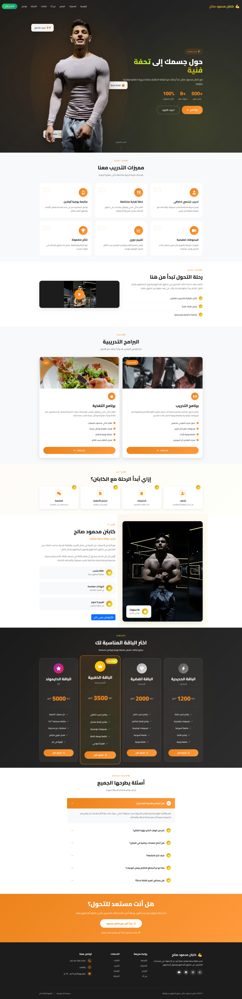
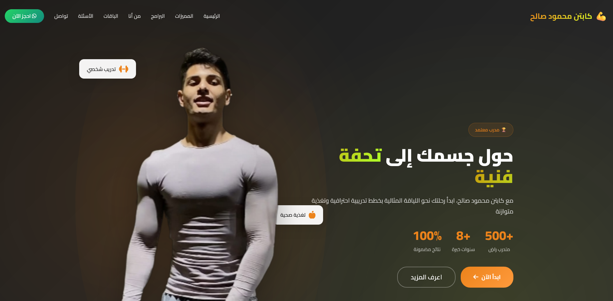

# 💪 Fitness Coach Website - Captain Mahmoud Saleh

<div align="center">


A modern, fully responsive Arabic fitness coaching website with elegant animations and professional design.

[Live Demo](https://coachmahmoudsaleh.com/) | [Features](#-features) | [Installation](#-installation)

</div>

---

## 📸 Screenshots

### Full Website Preview


### Hero Section


---

## 📖 About

A professional fitness coaching website built for **Captain Mahmoud Saleh**, featuring a complete online training platform with membership packages, video integration, and direct WhatsApp booking system. The website is optimized for Arabic (RTL) layout with smooth animations and mobile-first design.

## ✨ Features

### 🎨 Design & UX
- **Fully Responsive** - Optimized for mobile, tablet, and desktop devices
- **RTL Support** - Native Arabic right-to-left layout
- **Smooth Animations** - AOS (Animate On Scroll) integration
- **Modern UI/UX** - Clean, professional design with gradient effects
- **Dark Theme** - Elegant dark color scheme with orange/lime accents

### 💼 Core Sections
- **Hero Section** - Animated background with floating cards and statistics
- **Benefits Cards** - 6 animated benefit cards with hover effects
- **Video Section** - YouTube video integration with direct link
- **Training Programs** - Detailed program cards for training and nutrition
- **Journey Steps** - 4-step process showing how to start with the coach
- **About Section** - Coach profile with achievements and certifications
- **Membership Packages** - 4 pricing tiers:
  - **Iron Package**: Training program + Nutrition program
  - **Silver Package**: Training + Nutrition + Videos + Weekly follow-up
  - **Gold Package**: All features + Recipe book + Daily follow-up + Weekly assessment
  - **Diamond Package**: All Gold features + 24/7 support + Unlimited consultations
- **Testimonials Section** - Before and after transformation images
- **FAQ Accordion** - 6 commonly asked questions with smooth transitions
- **CTA Section** - Call-to-action with gradient background
- **Footer** - Complete contact information and social links

### 🔧 Technical Features
- **Mobile Menu** - Custom slide-in navigation for small screens
- **Smooth Scrolling** - Animated page navigation
- **Counter Animation** - Statistics counter on hero section
- **Video Modal** - YouTube Shorts direct link integration
- **Scroll to Top** - Floating button with smooth scroll
- **WhatsApp Integration** - Direct booking links throughout the site
- **SEO Optimized** - Semantic HTML structure
- **Cache Busting** - Version parameters on all assets (v=1.3)

## 🎨 Color Scheme

```css
Primary Color:    #FFD700 (Gold)
Secondary Color:  #1C1C1C (Dark Gray)
Background:       #0D0D0D (Deep Black)
Card Background:  #1F1F1F (Dark Gray)
Text Light:       #E0E0E0 (Light Gray)
```

## 🛠️ Technologies Used

- **HTML5** - Semantic markup
- **CSS3** - Custom properties, flexbox, grid, animations
- **JavaScript** - jQuery for DOM manipulation
- **Bootstrap 5 RTL** - Layout framework with Arabic support
- **Font Awesome 6.4.0** - Icon library
- **AOS 2.3.1** - Scroll animation library
- **Swiper 11** - Touch slider (available for future use)
- **Cairo Font** - Google Fonts for Arabic typography

## 📁 Project Structure

```
Coach/
├── index.html              # Main HTML file
├── css/
│   └── style.css          # Custom styles (~1700 lines)
├── js/
│   └── script.js          # Custom scripts (~400 lines)
├── images/
│   ├── mahmoud.png        # Hero image
│   ├── DSC01869-copy-(1).jpg  # About image
│   ├── Group-40.png       # Training program image
│   ├── Group-40-(1).png   # Nutrition program image
│   ├── Untitled-design-(15).png  # Video thumbnail
│   ├── Testimonials_Before.jpeg  # Before transformation
│   └── Testimonials_After.jpeg   # After transformation
└── README.md              # Documentation
```

## 🚀 Installation

### Quick Start

1. **Clone the repository**
   ```bash
   git clone https://github.com/yourusername/fitness-coach-website.git
   cd fitness-coach-website
   ```

2. **Open in browser**
   ```bash
   # Simply open index.html in your browser
   # Or use a local server:
   
   # Python
   python -m http.server 8000
   
   # Node.js (with http-server)
   npx http-server
   ```

3. **Visit**
   ```
   http://localhost:8000
   ```

### Customization

#### Update Contact Information

Edit `index.html` and replace all instances of:
- **Phone**: `+201012552752`
- **Coach Name**: `كابتن محمود صالح`
- **Social Links**: Update footer social media URLs

#### Change Colors

Modify CSS variables in `css/style.css`:
```css
:root {
    --primary-color: #FFD700;
    --bg-dark: #0D0D0D;
    --card-bg: #1F1F1F;
    --text-dark: #E0E0E0;
}
```

#### Update YouTube Video

Change video URL in `js/script.js`:
```javascript
const videoUrl = 'https://www.youtube.com/embed/_4mdmlDgRPk';
```

Or update the direct link in `index.html`:
```html
<a href="https://youtube.com/shorts/_4mdmlDgRPk" target="_blank" class="video-play-btn">
```

#### Modify Packages

Edit package prices and features in `index.html` under the `#packages` section.

## 📱 Responsive Breakpoints

- **Mobile**: < 767px
- **Tablet**: 768px - 991px
- **Desktop**: > 992px

## 🌐 Browser Support

- ✅ Chrome (latest)
- ✅ Firefox (latest)
- ✅ Safari (latest)
- ✅ Edge (latest)
- ✅ Mobile browsers (iOS Safari, Chrome Mobile)

## 📸 Screenshots

### Desktop View


### Mobile View


## 🎯 Performance

- Optimized images
- Minified CSS/JS ready
- Fast loading time
- Smooth animations (60fps)
- Mobile-first approach

## 📝 License

This project is licensed under the MIT License - see the [LICENSE](LICENSE) file for details.

## 👨‍💻 Author

**Your Name**
- Portfolio: [zomzam.com](#)
- GitHub: [@AhmedAbdelaziz](https://github.com/zomzam-aar)
- LinkedIn: [Ahmed Abdelaziz](https://www.linkedin.com/in/zomzam/)

## 🤝 Contributing

Contributions, issues, and feature requests are welcome! Feel free to check the [issues page](https://github.com/zomzam-aar/fitness-coach-website/issues).

## ⭐ Show Your Support

Give a ⭐️ if you like this project!

---

<div align="center">

**Made with ❤️ and lots of ☕**

</div>
- JavaScript (jQuery)
- Bootstrap 5 RTL
- AOS Animation Library
- Font Awesome Icons
- Google Fonts (Almarai)

## 📝 ملاحظات

- جميع الصور محملة محلياً في مجلد `images/`
- المكتبات محملة من CDN للسرعة
- الكود نظيف وسهل التعديل
- نظام الألوان متغيرات CSS للتحكم السهل

## 🎯 كيفية الاستخدام

1. افتح ملف `index.html` في المتصفح
2. للتعديل على التصميم: عدل في `css/style.css`
3. للتعديل على الوظائف: عدل في `js/script.js`
4. لتغيير الصور: استبدل الصور في مجلد `images/`

---

© 2024 كابتن أسامة سعيد - جميع الحقوق محفوظة
